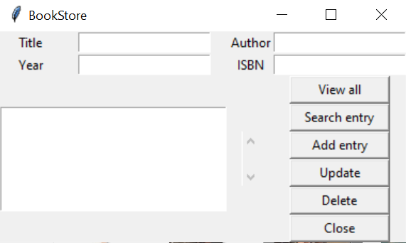

# A-Book-Inventory-Desktop-GUI-Database-app
This is a book inventory desktop GUI Database app.
use <pyinstaller --onefile --windowed frontend.py> to install to create an .exe file.
The app looks like this:

